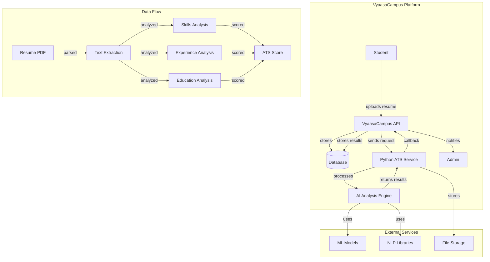
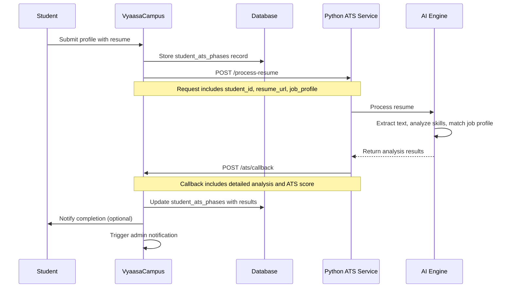

# ATS (Applicant Tracking System) Integration Documentation

## Overview

The VyaasaCampus platform integrates with a Python-based ATS service for automated resume analysis and scoring. This integration provides intelligent resume parsing, skill extraction, and job matching capabilities for student profiles.

## Architecture Overview



## Integration Flow



## API Integration

### Request to ATS Service

**Endpoint**: `POST {ATS_BASE_URL}/process-resume`

**Headers**:
```
Authorization: Bearer {ATS_SERVICE_TOKEN}
Content-Type: application/json
```

**Request Body**:
```json
{
  "request_id": "uuid",
  "student_id": "uuid",
  "tenant_id": "uuid",
  "resume_url": "https://s3.amazonaws.com/bucket/resume.pdf",
  "job_profile": {
    "role": "Software Engineer",
    "profile_text": "Looking for a software engineer with Python, React, and AWS experience..."
  },
  "callback_url": "https://vyaasa-campus.com/api/ats/callback",
  "metadata": {
    "student_name": "John Doe",
    "tenant_name": "Cambridge University",
    "preferred_role": "Software Engineer"
  }
}
```

### ATS Service Response

**Success Response (202)**:
```json
{
  "request_id": "uuid",
  "status": "processing",
  "estimated_completion_time": "2024-01-15T10:35:00Z",
  "message": "Resume processing started successfully"
}
```

**Error Response (400)**:
```json
{
  "error": "invalid_request",
  "message": "Resume URL is not accessible",
  "details": {
    "resume_url": "URL returned 404 Not Found"
  }
}
```

## Callback Integration

### Callback Endpoint

**Endpoint**: `POST /api/ats/callback`

**Headers**:
```
Authorization: Bearer {ATS_SERVICE_JWT}
Content-Type: application/json
```

**Request Body**:
```json
{
  "request_id": "uuid",
  "student_id": "uuid",
  "ats_score": 85.5,
  "metadata": {
    "ts_score": 85,
    "completeness_score": 90,
    "professionalism_score": 95,
    "role_match_score": 80,
    "role_match_breakdown": {
      "direct_skill_match_percent": 70,
      "contextual_match_percent": 60,
      "overall_similarity_percent": 80
    },
    "areas_for_improvement": {
      "personal_info": ["Location is missing"],
      "summary": ["Professional Summary is missing"],
      "education": ["Education Entry 1: CGPA is missing"],
      "certifications": ["Not found"],
      "achievements": ["Not found"],
      "languages": ["Not found"]
    },
    "matching_keywords": ["python", "javascript", "react", "node.js"],
    "missing_keywords": ["docker", "kubernetes", "aws", "git"]
  },
  "personal_information": {
    "full_name": "John Doe",
    "contact_number": "+91XXXXXXXXXX",
    "email_address": "john@example.com",
    "location": "Hyderabad, India"
  },
  "portfolio_and_links": {
    "linkedin": "https://linkedin.com/in/johndoe",
    "github": "https://github.com/johndoe",
    "other_links": ["https://portfolio.com", "mailto:x@x.com"]
  },
  "professional_summary": {
    "summary_text": "Experienced developer with expertise in web technologies",
    "total_experience": "2 years"
  },
  "skills": {
    "technical_skills": ["python", "javascript", "react", "node.js"],
    "non_technical_skills": ["management", "communication"],
    "other_mentioned_terms": ["science", "computer", "engineering"]
  },
  "work_experience": [
    {
      "job_index": 1,
      "job_title": "Software Developer Intern",
      "company_name": "Tech Corp",
      "start_date": "2023-01-01",
      "end_date": "2023-06-30",
      "responsibilities": "Developed web applications using React and Node.js"
    }
  ],
  "projects": [
    {
      "project_index": 1,
      "project_name": "E-commerce Platform",
      "technologies_used": ["React", "Node.js", "MongoDB"],
      "description": "Built a full-stack e-commerce platform with user authentication"
    }
  ],
  "education": [
    {
      "education_index": 1,
      "degree": "Bachelor of Technology",
      "institution": "KL University",
      "years": "2020-2024",
      "specialization": "Computer Science",
      "cgpa_or_percentage": "8.5"
    }
  ],
  "certifications": [
    {
      "certification_name": "AWS Certified Developer",
      "issuing_organization": "Amazon Web Services",
      "issue_date": "2023-06-01",
      "expiry_date": "2026-06-01"
    }
  ],
  "languages": [
    {
      "language": "English",
      "proficiency": "Native"
    }
  ],
  "achievements_and_activities": [
    {
      "achievement": "Winner of Hackathon 2023",
      "description": "Built an AI-powered solution for healthcare management"
    }
  ],
  "sanity_check": {
    "professionalism_score": 90,
    "notes": "Well-structured resume with clear formatting"
  },
  "extracted_raw_text_snippets": {
    "personal_info_raw": ["Full Name", "Contact Number", "Email Address"],
    "links_raw": ["mailto:x@x.com", "https://linkedin.com/in/johndoe"],
    "professional_summary_raw": ["Summary/Objective", "Total Experience"],
    "skills_raw": ["python", "javascript", "react", "node.js"],
    "work_experience_raw": ["Job #1: Software Developer Intern"],
    "projects_raw": ["E-commerce Platform"],
    "education_raw": ["Education #1: Bachelor of Technology"]
  }
}
```

### Callback Response

**Success Response (200)**:
```json
{
  "message": "ATS callback processed successfully",
  "student_id": "uuid",
  "ats_phase_id": "uuid",
  "ats_score": 85.5
}
```

## Database Schema Integration

### student_ats_phases Table

The ATS integration uses the `student_ats_phases` table to track processing status and store results:

```sql
CREATE TABLE student_ats_phases (
    id UUID PRIMARY KEY DEFAULT gen_random_uuid(),
    student_id UUID NOT NULL REFERENCES students(id) ON DELETE CASCADE,
    tenant_id UUID NOT NULL,
    
    -- Resume Processing Info
    resume_url VARCHAR(255) NOT NULL,
    status VARCHAR(255) DEFAULT 'processing',
    processed_at TIMESTAMP WITH TIME ZONE,
    
    -- ATS Analysis Results
    ats_score DECIMAL(5,2),
    processing_attempts INTEGER DEFAULT 0,
    last_processing_error TEXT,
    processor_metadata JSONB DEFAULT '{}',
    raw_result_json JSONB DEFAULT '{}',
    idempotency_key VARCHAR(255),
    callback_received_at TIMESTAMP WITH TIME ZONE,
    
    -- Extracted Data Fields
    personal_information JSONB DEFAULT '{}',
    portfolio_and_links JSONB DEFAULT '{}',
    professional_summary JSONB DEFAULT '{}',
    skills JSONB DEFAULT '{}',
    work_experience JSONB[] DEFAULT '{}',
    projects JSONB[] DEFAULT '{}',
    education JSONB[] DEFAULT '{}',
    certifications JSONB[] DEFAULT '{}',
    languages JSONB[] DEFAULT '{}',
    achievements_and_activities JSONB[] DEFAULT '{}',
    sanity_check JSONB DEFAULT '{}',
    extracted_raw_text_snippets JSONB DEFAULT '{}',
    
    -- System Fields
    metadata JSONB DEFAULT '{}',
    deleted_at TIMESTAMP WITH TIME ZONE,
    retention_policy_days INTEGER DEFAULT 90,
    
    created_at TIMESTAMP WITH TIME ZONE DEFAULT NOW(),
    updated_at TIMESTAMP WITH TIME ZONE DEFAULT NOW(),
    
    UNIQUE(student_id)
);
```

## Configuration

### Environment Variables

```bash
# ATS Service Configuration
ATS_BASE_URL=http://localhost:8000
ATS_SERVICE_TOKEN=your_ats_service_token
ATS_SERVICE_JWT_SECRET=your_jwt_secret_for_callbacks

# File Storage (Local - AWS S3 planned for future)
# Files stored in priv/uploads/ directory
# AWS_ACCESS_KEY_ID=your_aws_key (future)
# AWS_SECRET_ACCESS_KEY=your_aws_secret (future)
# AWS_REGION=us-east-1 (future)
# AWS_BUCKET=vyaasa-campus-resumes (future)

# Processing Configuration
ATS_PROCESSING_TIMEOUT=300000  # 5 minutes in milliseconds
ATS_MAX_RETRY_ATTEMPTS=3
ATS_RETRY_DELAY=5000  # 5 seconds
```

### Runtime Configuration

```elixir
# config/runtime.exs
config :vyaasa_campus,
  ats_base_url: System.get_env("ATS_BASE_URL", "http://localhost:8000"),
  ats_service_token: System.get_env("ATS_SERVICE_TOKEN"),
  ats_service_jwt_secret: System.get_env("ATS_SERVICE_JWT_SECRET"),
  ats_processing_timeout: String.to_integer(System.get_env("ATS_PROCESSING_TIMEOUT", "300000")),
  ats_max_retry_attempts: String.to_integer(System.get_env("ATS_MAX_RETRY_ATTEMPTS", "3")),
  ats_retry_delay: String.to_integer(System.get_env("ATS_RETRY_DELAY", "5000"))
```

## Implementation Details

### ATS Context Module

```elixir
defmodule VyaasaCampus.Contexts.Ats do
  @moduledoc """
  ATS (Applicant Tracking System) integration context.
  Handles resume processing requests and callback handling.
  """
  
  alias VyaasaCampus.Repo
  alias VyaasaCampus.Schema.Students.StudentAtsPhase
  
  def process_resume(student_id, resume_url, job_profile) do
    # Create ATS phase record
    # Send request to Python ATS service
    # Handle response and errors
  end
  
  def handle_callback(callback_data) do
    # Validate callback authenticity
    # Update student_ats_phases record
    # Trigger notifications
  end
  
  def get_ats_results(student_id) do
    # Retrieve ATS analysis results
  end
end
```

### Background Job Processing

```elixir
defmodule VyaasaCampus.Jobs.AtsResumeProcessor do
  use Oban.Worker, queue: :ats_processing
  
  def perform(%Oban.Job{args: %{"student_id" => student_id, "resume_url" => resume_url}}) do
    # Process resume with ATS service
    # Handle retries and error cases
    # Update processing status
  end
end
```

### JD Decomposition Cache (native relevance scoring)

Relevance scoring judges each résumé against a list of discrete JD requirements
produced by an LLM (`Relevance.decompose_jd/1`). Re-running that decomposition on
every score is slow and non-deterministic — the same JD yields slightly different
requirement sets across runs, so identical résumés can score differently.

To make scores reproducible, decompositions are cached in the **public**
`jd_decompositions` table (keyed by a SHA-256 of the model + normalized JD text):

- `VyaasaCampus.Contexts.JdDecompositions.get_or_decompose/3` — returns the stored
  requirement list, only invoking the LLM on a cache miss (then persisting it).
  Falls back to a live decomposition if the DB is unavailable, so scoring never
  breaks.
- The cache key folds in the model tag, so changing `@model` transparently
  re-decomposes.
- **Seeding a JD library:** `mix jd.seed All_JDs.zip` (or a directory of `.txt`
  JDs) pre-decomposes each JD once and stores it with `source` set to the file's
  relative path. Idempotent — re-runs reuse existing rows.

**Scoring rubric — canonical role JD:** The super admin can author a
`job_description` per role on the Jobs screen (`job_roles.job_description`). When
present, `AtsResumeProcessor.lookup_role_jd/1` supplies it as the relevance
rubric (`job_description` opt) so every tenant scores résumés for that role
against the same requirement set. When a role has no JD, scoring falls back to
the tenant's job-profile markdown (or a profile built from the role's skills).
The authored JD is decomposed and cached like any other, and editing it (new
text ⇒ new hash) transparently re-decomposes and re-scores.

### Result Cache (identical resume ⇒ identical score)

Even with the JD decomposition cached, the pipeline still runs LLM calls (resume
parsing, per-requirement judging) that are **not** bit-for-bit deterministic at
temperature 0 (MoE routing / batching / GPU float non-associativity). To
guarantee that re-uploading the same resume against the same role always yields
the same score, `ResumeScorer.run/3` reads through a full-result cache:

- Public `resume_score_cache` table, keyed by
  `sha256(scorer_version + resume bytes + job_profile + job_description)`.
- `VyaasaCampus.Contexts.ResumeScoreCache.get_or_score/3` returns the frozen
  `service_response` on a hit; on a miss it runs the pipeline once and stores the
  successful result (errors are never cached). Safe DB fallback so scoring never
  breaks.
- `@scorer_version` in `ResumeScorer` — bump it to invalidate all cached scores
  after a scoring-logic change.

A cache hit returns in ~3 ms instead of ~30 s, and every subsequent identical
upload returns a byte-identical result.

## Error Handling

### Common Error Scenarios

1. **Resume URL Not Accessible**
   - Error: 404 Not Found
   - Handling: Retry with exponential backoff
   - Fallback: Notify admin for manual intervention

2. **ATS Service Timeout**
   - Error: Request timeout after 5 minutes
   - Handling: Mark as failed, allow manual retry
   - Fallback: Queue for retry with increased timeout

3. **Invalid Resume Format**
   - Error: Unsupported file format
   - Handling: Return error to student
   - Fallback: Provide format requirements

4. **Callback Authentication Failure**
   - Error: Invalid JWT token
   - Handling: Log security event, reject callback
   - Fallback: Alert security team

### Retry Strategy

```elixir
defmodule VyaasaCampus.Jobs.AtsRetryHandler do
  def retry_with_backoff(attempt, max_attempts \\ 3) do
    delay = :math.pow(2, attempt) * 1000  # Exponential backoff
    Process.sleep(round(delay))
    
    if attempt < max_attempts do
      # Retry the operation
    else
      # Mark as failed permanently
    end
  end
end
```

## Security Considerations

### Authentication

- **Service-to-Service**: JWT tokens for ATS service authentication
- **Callback Security**: Signed JWT tokens for callback validation
- **File Access**: Pre-signed URLs with expiration for resume access

### Data Protection

- **PII Handling**: Encrypted storage of personal information
- **Resume Storage**: Local file system storage with access controls (AWS S3 planned)
- **Data Retention**: Automatic cleanup based on retention policies

### Privacy Compliance

- **GDPR**: Right to deletion and data portability
- **Data Minimization**: Only store necessary information
- **Audit Trail**: Complete logging of data processing activities

## Monitoring and Analytics

### Metrics to Track

- **Processing Success Rate**: Percentage of successful resume analyses
- **Average Processing Time**: Time from request to callback
- **Error Rates**: Breakdown by error type and frequency
- **ATS Score Distribution**: Statistical analysis of scores
- **Retry Patterns**: Frequency and success of retry attempts

### Logging

```elixir
# ATS processing logs
Logger.info("ATS processing started", %{
  student_id: student_id,
  resume_url: resume_url,
  request_id: request_id
})

Logger.info("ATS callback received", %{
  student_id: student_id,
  ats_score: ats_score,
  processing_time: processing_time
})

Logger.error("ATS processing failed", %{
  student_id: student_id,
  error: error_message,
  retry_count: retry_count
})
```

## Testing

### Unit Tests

```elixir
defmodule VyaasaCampus.Contexts.AtsTest do
  use VyaasaCampus.DataCase, async: true
  
  describe "process_resume/3" do
    test "successfully processes resume" do
      # Test successful resume processing
    end
    
    test "handles invalid resume URL" do
      # Test error handling for invalid URLs
    end
    
    test "retries on service timeout" do
      # Test retry mechanism
    end
  end
  
  describe "handle_callback/1" do
    test "processes valid callback" do
      # Test callback processing
    end
    
    test "rejects invalid callback" do
      # Test security validation
    end
  end
end
```

### Integration Tests

```elixir
defmodule VyaasaCampus.Integration.AtsTest do
  use VyaasaCampus.ConnCase
  
  test "complete ATS workflow" do
    # Test end-to-end ATS processing workflow
    # 1. Student submits profile
    # 2. ATS service processes resume
    # 3. Callback updates database
    # 4. Admin can view results
  end
end
```

## Deployment Checklist

### Environment Setup

- [ ] ATS service deployed and accessible
- [ ] Environment variables configured
- [ ] File storage (AWS S3) configured
- [ ] JWT secrets generated and secured
- [ ] Database migrations executed

### Service Dependencies

- [ ] Python ATS service running
- [ ] AI/ML models loaded and accessible
- [ ] File storage service operational
- [ ] Background job processing enabled

### Monitoring Setup

- [ ] Logging configuration
- [ ] Metrics collection
- [ ] Error tracking
- [ ] Performance monitoring
- [ ] Alert configuration

## Troubleshooting

### Common Issues

1. **ATS Service Not Responding**
   - Check service health endpoint
   - Verify network connectivity
   - Check service logs for errors

2. **Callback Not Received**
   - Verify callback URL accessibility
   - Check JWT token configuration
   - Review network firewall settings

3. **Resume Processing Fails**
   - Validate resume file format
   - Check file storage permissions
   - Review ATS service logs

4. **Database Update Failures**
   - Check database connectivity
   - Verify schema migrations
   - Review constraint violations

### Debug Commands

```bash
# Check ATS service health
curl -H "Authorization: Bearer $ATS_SERVICE_TOKEN" \
     $ATS_BASE_URL/health

# Test callback endpoint
curl -X POST \
     -H "Authorization: Bearer $ATS_SERVICE_JWT" \
     -H "Content-Type: application/json" \
     -d @test_callback.json \
     http://localhost:4000/api/ats/callback

# Check processing status
mix ecto.query "SELECT * FROM student_ats_phases WHERE status = 'processing'"
```

This ATS integration provides a robust, scalable solution for automated resume analysis and scoring within the VyaasaCampus platform.
