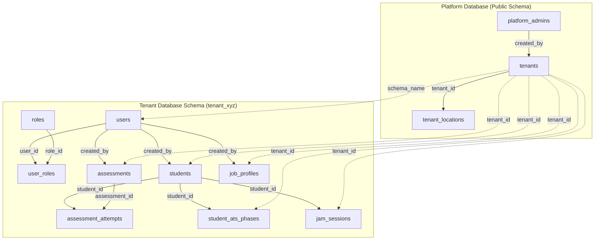
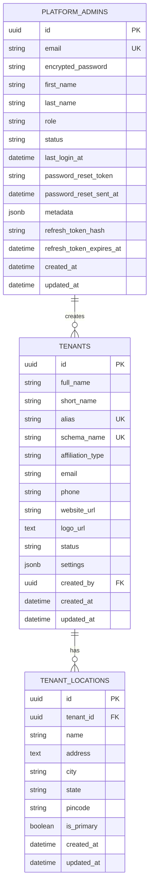
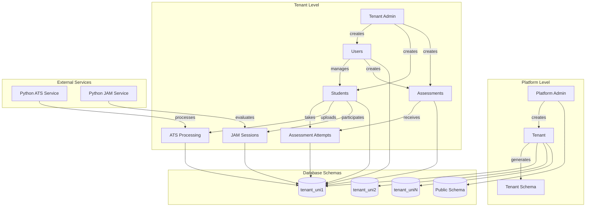

    # VyaasaCampus Database Schema Documentation

## Overview

VyaasaCampus uses a multi-tenant PostgreSQL database architecture with Ecto as the ORM and Triplex for tenant isolation. The database is organized into two main schemas: the public schema for platform-wide data and tenant-specific schemas for isolated tenant data.

## Database Architecture Diagram



## Entity Relationship Diagrams

### Public Schema ERD



### Tenant Schema ERD

```mermaid
erDiagram
    USERS {
        uuid id PK
        string email
        string encrypted_password
        string first_name
        string middle_name
        string last_name
        string phone
        string role
        string status
        datetime email_verified_at
        datetime last_login_at
        jsonb metadata
        string password_reset_token
        datetime password_reset_sent_at
        string temp_password
        datetime temp_password_sent_at
        string refresh_token_hash
        datetime refresh_token_expires_at
        uuid tenant_id
        uuid created_by_id
        string created_by_type
        datetime created_at
        datetime updated_at
    }
    
    ROLES {
        uuid id PK
        string name
        string display_name
        text description
        text_array permissions
        boolean is_system_role
        uuid tenant_id
        uuid created_by_id
        string created_by_type
        datetime created_at
        datetime updated_at
    }
    
    USER_ROLES {
        uuid id PK
        uuid user_id FK
        uuid role_id FK
        uuid assigned_by_id
        string assigned_by_type
        datetime assigned_at
        datetime created_at
        datetime updated_at
    }
    
    STUDENTS {
        uuid id PK
        string email
        string encrypted_password
        string first_name
        string middle_name
        string last_name
        string phone
        string registration_id
        string degree
        string specialization
        integer year_of_passing
        decimal cgpa
        string tenure
        string current_academic_year
        uuid location_id
        string status
        boolean profile_completed
        datetime profile_submitted_at
        datetime profile_approved_at
        datetime profile_rejected_at
        datetime profile_reviewed_at
        datetime edit_requested_at
        uuid approved_by_id
        text admin_notes
        text edit_request_notes
        string profile_token
        datetime profile_token_sent_at
        datetime profile_token_expires_at
        jsonb edit_request_data
        string edit_request_token
        datetime edit_request_token_expires_at
        datetime email_verified_at
        datetime last_login_at
        string password_reset_token
        datetime password_reset_sent_at
        string temp_password
        datetime temp_password_sent_at
        string refresh_token_hash
        datetime refresh_token_expires_at
        jsonb metadata
        uuid tenant_id
        uuid created_by_id
        string created_by_type
        datetime created_at
        datetime updated_at
    }
    
    ASSESSMENTS {
        uuid id PK
        string title
        text description
        string assessment_type
        integer total_marks
        decimal weightage
        integer passing_marks
        integer duration_minutes
        jsonb time_period
        string status
        uuid created_by FK
        jsonb settings
        uuid tenant_id
        datetime created_at
        datetime updated_at
    }
    
    ASSESSMENT_ATTEMPTS {
        uuid id PK
        uuid assessment_id FK
        uuid student_id FK
        datetime started_at
        datetime completed_at
        datetime submitted_at
        integer obtained_marks
        integer total_marks
        decimal score
        decimal percentage
        string status
        jsonb answers
        jsonb evaluation_data
        integer attempt_number
        jsonb metadata
        datetime created_at
        datetime updated_at
    }
    
    STUDENT_ATS_PHASES {
        uuid id PK
        uuid student_id FK
        uuid tenant_id
        string resume_url
        string status
        datetime processed_at
        string preferred_role
        string college_id_card_url
        string profile_picture_url
        decimal ats_score
        integer processing_attempts
        text last_processing_error
        jsonb processor_metadata
        jsonb raw_result_json
        string idempotency_key
        datetime callback_received_at
        datetime deleted_at
        integer retention_policy_days
        jsonb metadata
        jsonb personal_information
        jsonb portfolio_and_links
        jsonb professional_summary
        jsonb skills
        jsonb_array work_experience
        jsonb_array projects
        jsonb_array education
        jsonb_array certifications
        jsonb_array languages
        jsonb_array achievements_and_activities
        jsonb sanity_check
        jsonb extracted_raw_text_snippets
        datetime created_at
        datetime updated_at
    }
    
    JAM_SESSIONS {
        uuid id PK
        uuid student_id FK
        uuid tenant_id
        string session_token UK
        string status
        text topic_title
        text topic_explanation
        boolean topic_changed
        boolean change_topic_available
        text recording_file_path
        integer recording_duration_seconds
        boolean recording_active
        text transcript
        integer word_count
        integer speech_duration_seconds
        jsonb evaluation_data
        integer final_score
        integer clarity_score
        integer structure_score
        integer relevance_score
        integer impact_score
        integer confidence_score
        text overall_summary
        integer decision_time_seconds
        integer preparation_time_seconds
        integer speech_time_seconds
        integer actual_decision_time_used
        integer actual_preparation_time_used
        integer actual_speech_time_used
        boolean webrtc_connected
        decimal audio_quality_score
        decimal noise_level
        text error_message
        integer retry_count
        datetime created_at
        datetime updated_at
        datetime completed_at
    }
    
    JOB_PROFILES {
        uuid id PK
        string role
        text profile_text
        uuid tenant_id
        uuid created_by_id
        string created_by_type
        datetime created_at
        datetime updated_at
    }
    
    USERS ||--o{ USER_ROLES : has
    ROLES ||--o{ USER_ROLES : assigned_to
    USERS ||--o{ STUDENTS : creates
    USERS ||--o{ ASSESSMENTS : creates
    USERS ||--o{ JOB_PROFILES : creates
    STUDENTS ||--o{ ASSESSMENT_ATTEMPTS : attempts
    ASSESSMENTS ||--o{ ASSESSMENT_ATTEMPTS : has_attempts
    STUDENTS ||--o{ STUDENT_ATS_PHASES : has_ats_data
    STUDENTS ||--o{ JAM_SESSIONS : participates_in
```



## Data Flow Diagram



## Database Architecture

### Multi-Tenant Design

The application uses a **schema-per-tenant** approach where each tenant (institution) has its own database schema. This provides complete data isolation between tenants while sharing the same database instance.

- **Public Schema**: Contains platform-wide data (platform admins, tenants, tenant locations)
- **Tenant Schemas**: Each tenant has a dedicated schema (e.g., `tenant_cambridge_uni`) containing all tenant-specific data

### Schema Naming Convention

- **Public Schema**: `public`
- **Tenant Schemas**: `tenant_{first_8_chars_of_tenant_uuid}` (e.g., `tenant_cambridge_uni`)

## Ecto Configuration

### Repository Setup

```elixir
defmodule VyaasaCampus.Repo do
  use Ecto.Repo,
    otp_app: :vyaasa_campus,
    adapter: Ecto.Adapters.Postgres,
    migration_primary_key: [type: :binary_id],
    migration_foreign_key: [type: :binary_id]
end
```

### Key Configuration Features

- **Binary IDs**: All primary and foreign keys use UUIDs for better distributed system support
- **UTC Timestamps**: All timestamps are stored in UTC with `:utc_datetime` type
- **Multi-tenant Support**: Triplex integration for schema-based tenant isolation

## Triplex Configuration

### Setup

```elixir
# config/config.exs
config :triplex,
  repo: VyaasaCampus.Repo,
  tenant_name_prefix: "tenant_",
  tenant_migrations_path: "priv/repo/tenant_migrations"
```

### Migration Structure

- **Public Migrations**: `priv/repo/migrations/` - Platform-wide tables
- **Tenant Migrations**: `priv/repo/tenant_migrations/` - Tenant-specific tables

## Public Schema Tables

### platform_admins

Platform administrators who manage the entire system.

```sql
CREATE TABLE platform_admins (
    id UUID PRIMARY KEY DEFAULT gen_random_uuid(),
    email VARCHAR(255) UNIQUE NOT NULL,
    encrypted_password VARCHAR(255) NOT NULL,
    first_name VARCHAR(255) NOT NULL,
    last_name VARCHAR(255) NOT NULL,
    role VARCHAR(255) NOT NULL,
    status VARCHAR(255) DEFAULT 'active',
    last_login_at TIMESTAMP WITH TIME ZONE,
    password_reset_token VARCHAR(255),
    password_reset_sent_at TIMESTAMP WITH TIME ZONE,
    metadata JSONB DEFAULT '{}',
    refresh_token_hash VARCHAR(255),
    refresh_token_expires_at TIMESTAMP WITH TIME ZONE,
    created_at TIMESTAMP WITH TIME ZONE DEFAULT NOW(),
    updated_at TIMESTAMP WITH TIME ZONE DEFAULT NOW()
);
```

**Key Features:**
- Platform-wide authentication
- JWT refresh token support
- Password reset functionality
- Metadata storage for extensibility

### tenants

Institution/tenant information and configuration.

```sql
CREATE TABLE tenants (
    id UUID PRIMARY KEY DEFAULT gen_random_uuid(),
    full_name VARCHAR(255) NOT NULL,
    short_name VARCHAR(255) NOT NULL,
    alias VARCHAR(255) UNIQUE NOT NULL,
    schema_name VARCHAR(255) UNIQUE NOT NULL,
    affiliation_type VARCHAR(255) NOT NULL,
    email VARCHAR(255),
    phone VARCHAR(255),
    website_url VARCHAR(255),
    logo_url TEXT,
    status VARCHAR(255) DEFAULT 'active',
    settings JSONB DEFAULT '{}',
    created_by UUID REFERENCES platform_admins(id),
    created_at TIMESTAMP WITH TIME ZONE DEFAULT NOW(),
    updated_at TIMESTAMP WITH TIME ZONE DEFAULT NOW()
);
```

**Key Features:**
- Unique alias for URL routing
- Schema name for database isolation
- Affiliation type classification
- Settings JSONB for tenant-specific configuration

### tenant_locations

Physical locations for each tenant.

```sql
CREATE TABLE tenant_locations (
    id UUID PRIMARY KEY DEFAULT gen_random_uuid(),
    tenant_id UUID NOT NULL REFERENCES tenants(id) ON DELETE CASCADE,
    name VARCHAR(255) NOT NULL,
    address TEXT,
    city VARCHAR(255),
    state VARCHAR(255),
    pincode VARCHAR(255),
    is_primary BOOLEAN DEFAULT FALSE,
    created_at TIMESTAMP WITH TIME ZONE DEFAULT NOW(),
    updated_at TIMESTAMP WITH TIME ZONE DEFAULT NOW()
);
```

## Tenant Schema Tables

Each tenant schema contains the following tables for complete data isolation.

### users

Tenant administrators and staff members.

```sql
CREATE TABLE users (
    id UUID PRIMARY KEY DEFAULT gen_random_uuid(),
    email VARCHAR(255) NOT NULL,
    encrypted_password VARCHAR(255),
    first_name VARCHAR(255) NOT NULL,
    middle_name VARCHAR(255),
    last_name VARCHAR(255) NOT NULL,
    phone VARCHAR(255),
    role VARCHAR(255) NOT NULL,
    status VARCHAR(255) DEFAULT 'pending',
    email_verified_at TIMESTAMP WITH TIME ZONE,
    last_login_at TIMESTAMP WITH TIME ZONE,
    metadata JSONB DEFAULT '{}',
    password_reset_token VARCHAR(255),
    password_reset_sent_at TIMESTAMP WITH TIME ZONE,
    temp_password VARCHAR(255),
    temp_password_sent_at TIMESTAMP WITH TIME ZONE,
    refresh_token_hash VARCHAR(255),
    refresh_token_expires_at TIMESTAMP WITH TIME ZONE,
    tenant_id UUID NOT NULL,
    created_by_id UUID,
    created_by_type VARCHAR(255),
    created_at TIMESTAMP WITH TIME ZONE DEFAULT NOW(),
    updated_at TIMESTAMP WITH TIME ZONE DEFAULT NOW(),
    
    UNIQUE(tenant_id, email)
);
```

**Key Features:**
- Tenant-scoped user management
- Polymorphic creator tracking (public/tenant)
- Temporary password support for onboarding
- JWT refresh token support

### students

Student records with comprehensive profile management.

```sql
CREATE TABLE students (
    id UUID PRIMARY KEY DEFAULT gen_random_uuid(),
    
    -- Basic Authentication & Contact Info
    email VARCHAR(255) NOT NULL,
    encrypted_password VARCHAR(255),
    first_name VARCHAR(255) NOT NULL,
    middle_name VARCHAR(255),
    last_name VARCHAR(255) NOT NULL,
    phone VARCHAR(255) NOT NULL,
    
    -- Academic Information
    registration_id VARCHAR(255) NOT NULL,
    degree VARCHAR(255) NOT NULL,
    specialization VARCHAR(255) NOT NULL,
    year_of_passing INTEGER NOT NULL,
    cgpa DECIMAL(4,2) NOT NULL,
    
    -- Additional Academic Info
    tenure VARCHAR(255),
    current_academic_year VARCHAR(255),
    location_id UUID,
    
    -- Status & Workflow
    status VARCHAR(255) DEFAULT 'pending',
    profile_completed BOOLEAN DEFAULT FALSE,
    profile_submitted_at TIMESTAMP WITH TIME ZONE,
    profile_approved_at TIMESTAMP WITH TIME ZONE,
    profile_rejected_at TIMESTAMP WITH TIME ZONE,
    profile_reviewed_at TIMESTAMP WITH TIME ZONE,
    edit_requested_at TIMESTAMP WITH TIME ZONE,
    approved_by_id UUID,
    admin_notes TEXT,
    edit_request_notes TEXT,
    
    -- Profile Completion Token
    profile_token VARCHAR(255),
    profile_token_sent_at TIMESTAMP WITH TIME ZONE,
    profile_token_expires_at TIMESTAMP WITH TIME ZONE,
    
    -- Profile Edit Request Fields
    edit_request_data JSONB DEFAULT '{}',
    edit_request_token VARCHAR(255),
    edit_request_token_expires_at TIMESTAMP WITH TIME ZONE,
    
    -- Authentication & Security
    email_verified_at TIMESTAMP WITH TIME ZONE,
    last_login_at TIMESTAMP WITH TIME ZONE,
    password_reset_token VARCHAR(255),
    password_reset_sent_at TIMESTAMP WITH TIME ZONE,
    temp_password VARCHAR(255),
    temp_password_sent_at TIMESTAMP WITH TIME ZONE,
    refresh_token_hash VARCHAR(255),
    refresh_token_expires_at TIMESTAMP WITH TIME ZONE,
    
    -- System Fields
    metadata JSONB DEFAULT '{}',
    tenant_id UUID NOT NULL,
    created_by_id UUID,
    created_by_type VARCHAR(255),
    created_at TIMESTAMP WITH TIME ZONE DEFAULT NOW(),
    updated_at TIMESTAMP WITH TIME ZONE DEFAULT NOW(),
    
    UNIQUE(tenant_id, email),
    UNIQUE(tenant_id, registration_id)
);
```

**Key Features:**
- Multi-step profile completion workflow
- Token-based profile completion system
- Admin approval/rejection workflow
- Profile edit request system for active students
- Comprehensive academic information tracking

### roles

Role-based access control for tenant users.

```sql
CREATE TABLE roles (
    id UUID PRIMARY KEY DEFAULT gen_random_uuid(),
    name VARCHAR(255) NOT NULL,
    display_name VARCHAR(255) NOT NULL,
    description TEXT,
    permissions TEXT[] DEFAULT '{}',
    is_system_role BOOLEAN DEFAULT FALSE,
    tenant_id UUID NOT NULL,
    created_by_id UUID,
    created_by_type VARCHAR(255),
    created_at TIMESTAMP WITH TIME ZONE DEFAULT NOW(),
    updated_at TIMESTAMP WITH TIME ZONE DEFAULT NOW(),
    
    UNIQUE(tenant_id, name)
);
```

### user_roles

Many-to-many relationship between users and roles.

```sql
CREATE TABLE user_roles (
    id UUID PRIMARY KEY DEFAULT gen_random_uuid(),
    user_id UUID NOT NULL REFERENCES users(id) ON DELETE CASCADE,
    role_id UUID NOT NULL REFERENCES roles(id) ON DELETE CASCADE,
    assigned_by_id UUID,
    assigned_by_type VARCHAR(255),
    assigned_at TIMESTAMP WITH TIME ZONE,
    created_at TIMESTAMP WITH TIME ZONE DEFAULT NOW(),
    updated_at TIMESTAMP WITH TIME ZONE DEFAULT NOW(),
    
    UNIQUE(user_id, role_id)
);
```

### assessments

Assessment/examination management.

```sql
CREATE TABLE assessments (
    id UUID PRIMARY KEY DEFAULT gen_random_uuid(),
    title VARCHAR(255) NOT NULL,
    description TEXT,
    assessment_type VARCHAR(255) NOT NULL,
    total_marks INTEGER NOT NULL,
    weightage DECIMAL(5,2),
    passing_marks INTEGER NOT NULL,
    duration_minutes INTEGER NOT NULL,
    time_period JSONB DEFAULT '{}',
    status VARCHAR(255) DEFAULT 'draft',
    created_by UUID NOT NULL REFERENCES users(id),
    settings JSONB DEFAULT '{}',
    tenant_id UUID NOT NULL,
    created_at TIMESTAMP WITH TIME ZONE DEFAULT NOW(),
    updated_at TIMESTAMP WITH TIME ZONE DEFAULT NOW()
);
```

### assessment_attempts

Student attempts at assessments.

```sql
CREATE TABLE assessment_attempts (
    id UUID PRIMARY KEY DEFAULT gen_random_uuid(),
    assessment_id UUID NOT NULL REFERENCES assessments(id) ON DELETE CASCADE,
    student_id UUID NOT NULL REFERENCES students(id) ON DELETE CASCADE,
    started_at TIMESTAMP WITH TIME ZONE NOT NULL,
    completed_at TIMESTAMP WITH TIME ZONE,
    submitted_at TIMESTAMP WITH TIME ZONE,
    obtained_marks INTEGER,
    total_marks INTEGER,
    score DECIMAL(5,2),
    percentage DECIMAL(5,2),
    status VARCHAR(255) DEFAULT 'started',
    answers JSONB DEFAULT '{}',
    evaluation_data JSONB DEFAULT '{}',
    attempt_number INTEGER DEFAULT 1,
    metadata JSONB DEFAULT '{}',
    created_at TIMESTAMP WITH TIME ZONE DEFAULT NOW(),
    updated_at TIMESTAMP WITH TIME ZONE DEFAULT NOW(),
    
    UNIQUE(assessment_id, student_id, attempt_number)
);
```

### student_ats_phases

ATS (Applicant Tracking System) processing data for students.

```sql
CREATE TABLE student_ats_phases (
    id UUID PRIMARY KEY DEFAULT gen_random_uuid(),
    student_id UUID NOT NULL REFERENCES students(id) ON DELETE CASCADE,
    tenant_id UUID NOT NULL,
    resume_url VARCHAR(255) NOT NULL,
    status VARCHAR(255) DEFAULT 'processing',
    processed_at TIMESTAMP WITH TIME ZONE,
    preferred_role VARCHAR(255),
    college_id_card_url VARCHAR(255),
    profile_picture_url VARCHAR(255),
    ats_score DECIMAL(5,2),
    processing_attempts INTEGER DEFAULT 0,
    last_processing_error TEXT,
    processor_metadata JSONB DEFAULT '{}',
    raw_result_json JSONB DEFAULT '{}',
    idempotency_key VARCHAR(255),
    callback_received_at TIMESTAMP WITH TIME ZONE,
    deleted_at TIMESTAMP WITH TIME ZONE,
    retention_policy_days INTEGER DEFAULT 90,
    
    -- ATS Analysis Data
    metadata JSONB DEFAULT '{}',
    personal_information JSONB DEFAULT '{}',
    portfolio_and_links JSONB DEFAULT '{}',
    professional_summary JSONB DEFAULT '{}',
    skills JSONB DEFAULT '{}',
    work_experience JSONB[] DEFAULT '{}',
    projects JSONB[] DEFAULT '{}',
    education JSONB[] DEFAULT '{}',
    certifications JSONB[] DEFAULT '{}',
    languages JSONB[] DEFAULT '{}',
    achievements_and_activities JSONB[] DEFAULT '{}',
    sanity_check JSONB DEFAULT '{}',
    extracted_raw_text_snippets JSONB DEFAULT '{}',
    
    created_at TIMESTAMP WITH TIME ZONE DEFAULT NOW(),
    updated_at TIMESTAMP WITH TIME ZONE DEFAULT NOW(),
    
    UNIQUE(student_id)
);
```

### jam_sessions

JAM (Just A Minute) speech assessment sessions.

```sql
CREATE TABLE jam_sessions (
    id UUID PRIMARY KEY DEFAULT gen_random_uuid(),
    student_id UUID NOT NULL REFERENCES students(id),
    tenant_id UUID NOT NULL,
    
    -- Session management
    session_token VARCHAR(255) UNIQUE NOT NULL,
    status VARCHAR(255) NOT NULL DEFAULT 'created',
    
    -- Topic information
    topic_title TEXT,
    topic_explanation TEXT,
    topic_changed BOOLEAN DEFAULT FALSE,
    change_topic_available BOOLEAN DEFAULT TRUE,
    
    -- Audio and recording
    recording_file_path TEXT,
    recording_duration_seconds INTEGER,
    recording_active BOOLEAN DEFAULT FALSE,
    
    -- Speech processing
    transcript TEXT,
    word_count INTEGER,
    speech_duration_seconds INTEGER,
    
    -- AI Evaluation
    evaluation_data JSONB,
    final_score INTEGER,
    clarity_score INTEGER,
    structure_score INTEGER,
    relevance_score INTEGER,
    impact_score INTEGER,
    confidence_score INTEGER,
    overall_summary TEXT,
    
    -- Timing information
    decision_time_seconds INTEGER DEFAULT 60,
    preparation_time_seconds INTEGER DEFAULT 15,
    speech_time_seconds INTEGER DEFAULT 60,
    actual_decision_time_used INTEGER,
    actual_preparation_time_used INTEGER,
    actual_speech_time_used INTEGER,
    
    -- WebRTC and technical
    webrtc_connected BOOLEAN DEFAULT FALSE,
    audio_quality_score DECIMAL(3,2),
    noise_level DECIMAL(3,2),
    
    -- Error handling
    error_message TEXT,
    retry_count INTEGER DEFAULT 0,
    
    created_at TIMESTAMP WITH TIME ZONE DEFAULT NOW(),
    updated_at TIMESTAMP WITH TIME ZONE DEFAULT NOW(),
    completed_at TIMESTAMP WITH TIME ZONE
);
```

### job_profiles

Job role profiles for ATS matching.

```sql
CREATE TABLE job_profiles (
    id UUID PRIMARY KEY DEFAULT gen_random_uuid(),
    role VARCHAR(255) NOT NULL,
    profile_text TEXT NOT NULL,
    tenant_id UUID NOT NULL,
    created_by_id UUID,
    created_by_type VARCHAR(255),
    created_at TIMESTAMP WITH TIME ZONE DEFAULT NOW(),
    updated_at TIMESTAMP WITH TIME ZONE DEFAULT NOW(),
    
    UNIQUE(tenant_id, role)
);
```

## Database Indexes

### Public Schema Indexes

```sql
-- Platform admins
CREATE UNIQUE INDEX platform_admins_email_index ON platform_admins(email);
CREATE INDEX platform_admins_refresh_token_hash_index ON platform_admins(refresh_token_hash);

-- Tenants
CREATE UNIQUE INDEX tenants_alias_index ON tenants(alias);
CREATE UNIQUE INDEX tenants_schema_name_index ON tenants(schema_name);
```

### Tenant Schema Indexes

```sql
-- Users
CREATE UNIQUE INDEX users_tenant_id_email_index ON users(tenant_id, email);
CREATE INDEX users_refresh_token_hash_index ON users(refresh_token_hash);

-- Students
CREATE UNIQUE INDEX students_tenant_id_email_index ON students(tenant_id, email);
CREATE UNIQUE INDEX students_tenant_id_registration_id_index ON students(tenant_id, registration_id);
CREATE INDEX students_tenant_id_status_index ON students(tenant_id, status);
CREATE INDEX students_tenant_id_profile_completed_index ON students(tenant_id, profile_completed);
CREATE INDEX students_refresh_token_hash_index ON students(refresh_token_hash);

-- Roles
CREATE UNIQUE INDEX roles_tenant_id_name_index ON roles(tenant_id, name);

-- User Roles
CREATE UNIQUE INDEX user_roles_user_id_role_id_index ON user_roles(user_id, role_id);

-- Assessments
CREATE INDEX assessments_tenant_id_status_index ON assessments(tenant_id, status);
CREATE INDEX assessments_tenant_id_assessment_type_index ON assessments(tenant_id, assessment_type);
CREATE INDEX assessments_tenant_id_created_by_index ON assessments(tenant_id, created_by);

-- Assessment Attempts
CREATE UNIQUE INDEX assessment_attempts_assessment_id_student_id_attempt_number_index 
    ON assessment_attempts(assessment_id, student_id, attempt_number);
CREATE INDEX assessment_attempts_student_id_status_index ON assessment_attempts(student_id, status);
CREATE INDEX assessment_attempts_assessment_id_status_index ON assessment_attempts(assessment_id, status);

-- Student ATS Phases
CREATE UNIQUE INDEX student_ats_phases_student_id_index ON student_ats_phases(student_id);
CREATE INDEX student_ats_phases_tenant_id_index ON student_ats_phases(tenant_id);
CREATE INDEX student_ats_phases_status_index ON student_ats_phases(status);
CREATE INDEX student_ats_phases_processed_at_index ON student_ats_phases(processed_at);
CREATE INDEX student_ats_phases_tenant_id_status_index ON student_ats_phases(tenant_id, status);
CREATE INDEX student_ats_phases_ats_score_index ON student_ats_phases(ats_score);
CREATE INDEX student_ats_phases_processing_attempts_index ON student_ats_phases(processing_attempts);
CREATE INDEX student_ats_phases_callback_received_at_index ON student_ats_phases(callback_received_at);
CREATE INDEX student_ats_phases_deleted_at_index ON student_ats_phases(deleted_at);

-- JAM Sessions
CREATE UNIQUE INDEX jam_sessions_session_token_index ON jam_sessions(session_token);
CREATE INDEX jam_sessions_student_id_index ON jam_sessions(student_id);
CREATE INDEX jam_sessions_tenant_id_index ON jam_sessions(tenant_id);
CREATE INDEX jam_sessions_status_index ON jam_sessions(status);
CREATE INDEX jam_sessions_created_at_index ON jam_sessions(created_at);
CREATE INDEX jam_sessions_completed_at_index ON jam_sessions(completed_at);
CREATE INDEX jam_sessions_final_score_index ON jam_sessions(final_score);
CREATE INDEX jam_sessions_student_id_tenant_id_index ON jam_sessions(student_id, tenant_id);
CREATE INDEX jam_sessions_tenant_id_status_index ON jam_sessions(tenant_id, status);

-- Job Profiles
CREATE UNIQUE INDEX job_profiles_tenant_id_role_index ON job_profiles(tenant_id, role);
CREATE INDEX job_profiles_tenant_id_index ON job_profiles(tenant_id);
```

## Migration Management

### Public Migrations

Located in `priv/repo/migrations/`:
- `20250708052800_create_public_tables.exs` - Creates platform_admins, tenants, tenant_locations
- `20250916070334_add_oban_jobs_table.exs` - Adds Oban job queue table

### Tenant Migrations

Located in `priv/repo/tenant_migrations/`:
- `20250709093101_create_tenant_tables_new.exs` - Creates all tenant-specific tables
- `20250915173919_add_ats_columns_and_job_profiles.exs` - Adds ATS processing columns and job_profiles table
- `20241220000001_create_jam_sessions.exs` - Creates JAM session tables

### Running Migrations

```bash
# Run public migrations
mix ecto.migrate

# Run tenant migrations for a specific tenant
mix triplex.migrate tenant_cambridge_uni
```

## Data Types and Constraints

### Primary Keys
- All tables use UUID primary keys with `gen_random_uuid()` default
- Binary ID type for better distributed system support

### Foreign Keys
- All foreign keys use UUID type
- Cascade deletes where appropriate for data integrity
- Tenant isolation enforced at application level

### JSONB Fields
- `metadata` - Flexible data storage for extensibility
- `settings` - Configuration and preferences
- `evaluation_data` - Assessment and ATS evaluation results
- `answers` - Student assessment responses
- `time_period` - Assessment scheduling information

### Status Fields
- Standardized status enums across all entities
- Status transitions managed in application logic
- Audit trail for status changes

### Timestamps
- All timestamps use `TIMESTAMP WITH TIME ZONE`
- UTC storage with application-level timezone conversion
- Automatic `created_at` and `updated_at` management

## Security Considerations

### Tenant Isolation
- Complete schema-level isolation between tenants
- No cross-tenant data access possible at database level
- Application-level tenant validation for all operations

### Data Protection
- Encrypted password storage using bcrypt
- JWT token hashing for refresh tokens
- Secure token generation for profile completion
- Input validation and sanitization

### Access Control
- Role-based access control within tenants
- Platform admin vs tenant user separation
- Student data privacy and access restrictions

## Performance Optimization

### Indexing Strategy
- Composite indexes for common query patterns
- Tenant-scoped indexes for multi-tenant queries
- Status and timestamp indexes for filtering
- Unique constraints for data integrity

### Query Optimization
- Tenant prefix usage for schema routing
- Efficient joins with proper foreign key relationships
- JSONB indexing for complex queries
- Pagination support for large datasets

### Connection Management
- Connection pooling with configurable pool size
- Prepared statements for common queries
- Database connection monitoring and health checks

## Backup and Recovery

### Backup Strategy
- Regular full database backups
- Point-in-time recovery capability
- Tenant-specific backup options
- Cross-region backup replication

### Data Retention
- Configurable retention policies for ATS data
- Soft delete patterns for audit trails
- Archive strategies for completed assessments
- GDPR compliance for data deletion

This database schema provides a robust, scalable foundation for the VyaasaCampus multi-tenant educational platform with comprehensive student management, assessment capabilities, and ATS integration.
