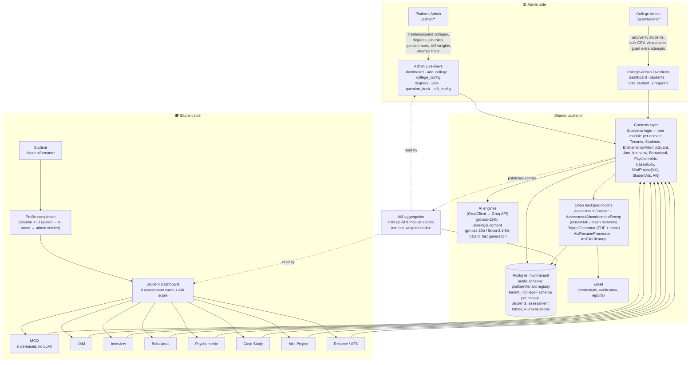

# Vyaasa Campus — Architecture

How the Admin side (Platform Admin + College Admin) and the Student side fit
together. Both run on the same Phoenix app and share one backend — they're
drawn separately below for readability, not because they're separate systems.

---

## System overview

---

## Admin side

Two tiers, same codebase, different scope:

| Tier | Route prefix | Scope |
|---|---|---|
| **Platform Admin** | `/admin/*` | Onboards colleges (tenants), configures degrees/specializations, job roles, the shared question bank, AI8 dimension weights, and per-college attempt limits |
| **College Admin** | `/user/:tenant/*` | Manages their own college: add/verify students (single or bulk CSV), view results and rankings, grant individual students extra attempts, run programs |

Both talk to the same **Contexts layer** — there's no separate admin backend, just narrower LiveViews and (for College Admin) requests scoped to their tenant schema.

## Student side

One flow, three phases:

1. **Onboarding** — upload resume + ID → AI parses the resume (`ai/resume/llm_parser.ex`, `relevance.ex`) → college admin verifies → student gets login credentials.
2. **Dashboard** — 8 assessment cards, each independently startable, plus a combined AI8 score.
3. **Assessments** — each has its own LiveView + Context module. MCQ is deterministic (no LLM); the other 7 call into Groq via `GroqClient`, with `reasoning_effort` split between fast generation (question/scenario/topic generation) and careful judgment (answer scoring, report synthesis) — see `docs/scoring-bands.md`.

Every assessment funnels into the same completion path regardless of whether the student finishes normally or closes the tab mid-session — see `docs/assessment-abandonment.md`.

## Shared backend

- **Contexts** — one Elixir module per domain (`Jam`, `Interview`, `Behavioral`, `Psychometric`, `CaseStudy`, `MiniProject`/`MiniProjectV4`, `StudentAts`, `AI8`, `Entitlements`/`AttemptGuard`, `Tenants`, `Students`...). LiveViews are thin — all real logic lives here, which is what both the admin and student LiveViews call into.
- **Multi-tenant Postgres** (Triplex) — one Postgres schema per college (`tenant_<alias>`), holding that college's students and assessment data in isolation; a `public` schema holds the platform-wide tenant registry.
- **AI engines** — `GroqClient` wraps the Groq API. `openai/gpt-oss-120b` handles anything that judges a student's work; a faster model handles turn-based/generative calls where latency matters more than deliberation.
- **AI8 aggregation** — every assessment publishes its scores into one shared evaluation table; AI8 rolls them up (per super-admin-configured dimension weights) into the single score shown on both the student dashboard and the admin's student-detail view.
- **Oban background jobs** — `AssessmentFinalizer` + `AssessmentAbandonmentSweep` recover abandoned sessions; `ReportGenerator` emails PDF reports; `AtsResumeProcessor`/`AtsFileCleanup` handle resume scoring and retention.

---

## Related docs

- `docs/user-guide.md` — role-by-role walkthrough
- `docs/attempt-limits.md` — how per-college attempt quotas work
- `docs/assessment-abandonment.md` — closed-tab / crash recovery
- `docs/ai8-scoring.md` — the AI8 aggregation model
- `docs/scoring-bands.md` — the shared 0–100 scoring calibration
