# RBAC & Data Scoping — Design Proposal

**Status:** Draft for team review · **Owner:** Platform / Backend · **Decision needed by:** before implementation starts

---

## Summary

VyaasaCampus has **no role-based access control today**. Authorization is decided entirely by
*which table a user lives in* — platform admin, tenant user, or student — giving three coarse
buckets and no row-level boundary.

Two consequences matter right now:

1. **Any tenant user can grant themselves any permission.** The `/api/tenant` scope exposes role
   management to every tenant user (`router.ex:236`). This is a live privilege-escalation path.
2. **Every tenant staff user can see every student in the tenant.** There is no notion of a
   faculty member being limited to their department, or a placement officer to their batch.

An RBAC skeleton already exists in the codebase — `roles` and `user_roles` tables, a management
API, and a `Scope` struct that already computes a permission list on every request — but
**nothing ever reads those permissions**. This proposal makes that skeleton real, adds row-level
scoping, and closes the escalation hole.

**Proposed approach:** permission strings held on roles, one central policy mapping every screen
and API action to a required permission, enforced fail-closed, plus a per-user data scope that
narrows student queries at the context layer.

---

## 1. Where we are today

Authorization flows from `Guardian`, which pattern-matches on the user struct
(`lib/vyaasa_campus/auth/guardian.ex:78-99`):

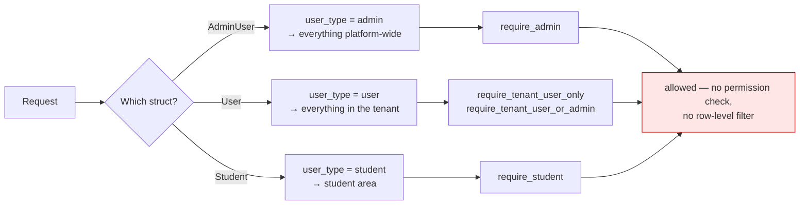

Our own docs describe tenant admins, faculty, placement cell, recruiters and principals as
distinct actors. The system cannot currently tell any of them apart.

### 1.1 Two defects, not just a gap

| # | Issue | Severity | Evidence |
|---|---|---|---|
| 1 | **Privilege escalation.** Any tenant user can create a role with arbitrary permissions and assign it to themselves. | High | `/api/tenant` is gated only by `require_tenant_user_or_admin` yet exposes `resources "/roles"` — `router.ex:236` |
| 2 | **Unbounded student visibility.** Any tenant staff user can list, approve, export and download documents for every student in the tenant. | High | Same scope covers student approval, resume / ID-card downloads, bulk create |
| 3 | **Dead RBAC code.** Roles are loaded and flattened into permissions on every request, then discarded. | — | `plugs/scope_plug.ex:161` builds `Scope.permissions`; no reader exists |

### 1.2 What we already have (and will reuse)

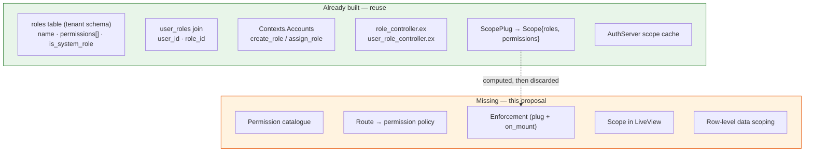

No new tables are needed for permissions. The only schema change is one column (§4).

### 1.3 Size of the surface

| Area | Surfaces | Auth today | Row scope today |
|---|---:|---|---|
| Student LiveViews | 32 | `require_student` | — |
| Platform-admin LiveViews | 11 | `require_admin` | n/a |
| Tenant-staff LiveViews | 4 | `require_tenant_user_only` | **none** |
| API controllers | 13 | 3 coarse pipelines | **none** |
| **Total** | **~60** | | |

> **Important:** `Scope` does not exist in LiveView at all. `ScopePlug` runs only on HTTP
> pipelines; the LiveView `on_mount` hooks (`plugs/auth_plug.ex:269-318`) assign only
> `current_user` and `user_type`. Since 47 of ~60 surfaces are LiveViews, fixing this is the
> load-bearing prerequisite for everything else.

---

## 2. Proposed architecture

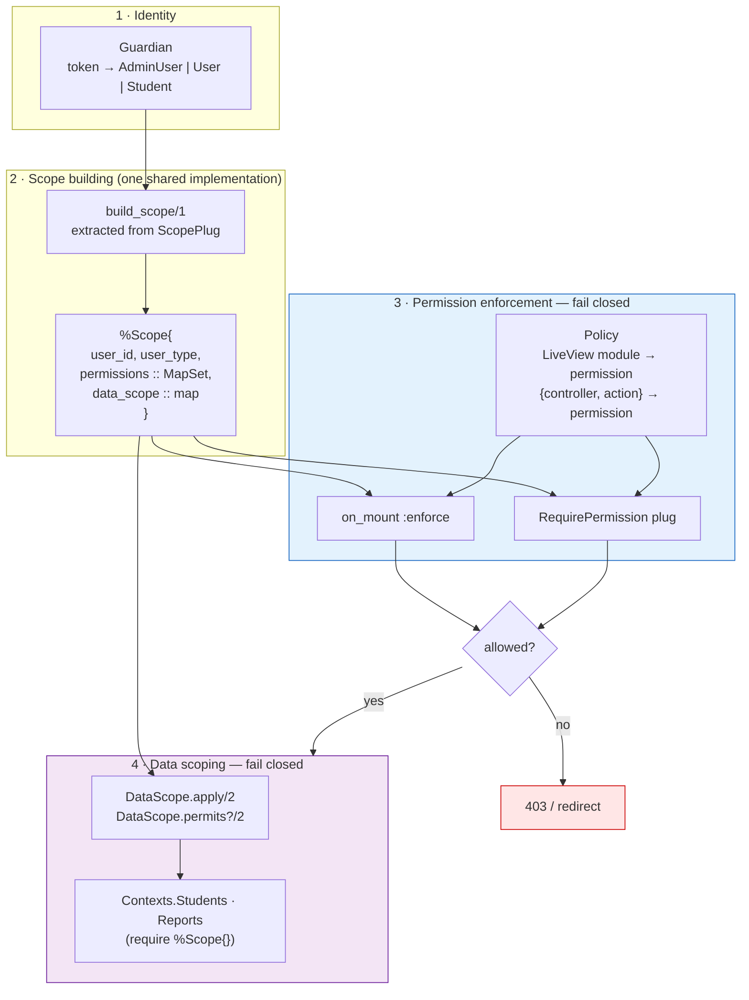

### 2.1 Request lifecycle

Both the HTTP and LiveView paths converge on one scope builder and one policy lookup:

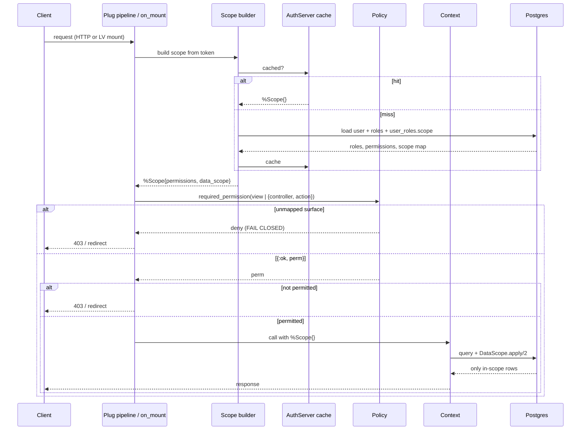

---

## 3. Permission model

### 3.1 Catalogue

A single source of truth in `lib/vyaasa_campus/auth/permissions.ex`:

| Resource | Permissions |
|---|---|
| `students` | `read` · `create` · `update` · `approve` · `export` · `documents` |
| `assessments` | `read` · `create` · `update` · `publish` · `archive` |
| `reports` | `download` |
| `programs` | `read` |
| `dashboard` | `view` |
| `users` | `manage` |
| `roles` | `manage` |
| *platform* | `tenants:manage` · `question_bank:manage` · `ai8:configure` · `degrees:manage` · `jobs:manage` |
| *student self* | `self:dashboard` · `self:profile` · `self:assessments` · `self:reports` |

Permissions are strings (`resource:action`) stored in the existing `roles.permissions` array, so
adding or retuning a role is a **data change, not a code change**.

### 3.2 Proposed system roles

`●` granted · `○` not granted — **this table is the main thing to review.**

| Permission | tenant_admin | placement_officer | faculty | recruiter |
|---|:--:|:--:|:--:|:--:|
| `dashboard:view` | ● | ● | ● | ● |
| `students:read` | ● | ● | ● | ● |
| `students:create` | ● | ○ | ○ | ○ |
| `students:update` | ● | ○ | ○ | ○ |
| `students:approve` | ● | ● | ○ | ○ |
| `students:export` | ● | ● | ○ | ○ |
| `students:documents` | ● | ● | ○ | ○ |
| `assessments:read` | ● | ● | ● | ○ |
| `assessments:create` | ● | ○ | ● | ○ |
| `assessments:publish` | ● | ○ | ● | ○ |
| `assessments:archive` | ● | ○ | ● | ○ |
| `reports:download` | ● | ● | ○ | ○ |
| `programs:read` | ● | ● | ● | ○ |
| **`users:manage`** | ● | ○ | ○ | ○ |
| **`roles:manage`** | ● | ○ | ○ | ○ |

The two bold rows are the escalation fix — today every tenant user effectively holds both.
Tenants can also define **custom roles** on top of these (`is_system_role` already exists).

### 3.3 How the three populations resolve

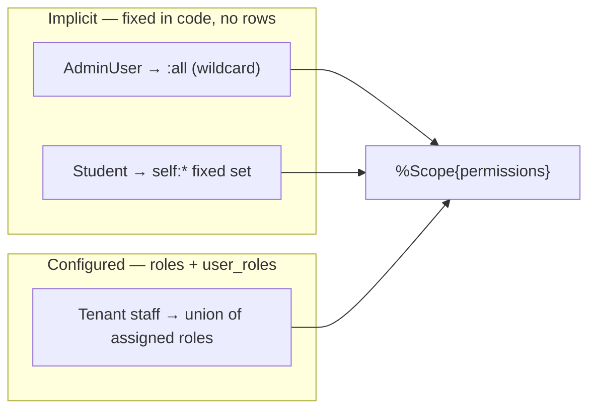

Keeping platform admins and students implicit means no second, public-schema role store is
needed, while enforcement stays uniform across all three.

---

## 4. Data scoping (row level)

There are no department / batch / program tables, so scoping keys on the columns that exist on
`students`: `specialization_id`, `degree_id`, `year_of_passing`, `location_id`.

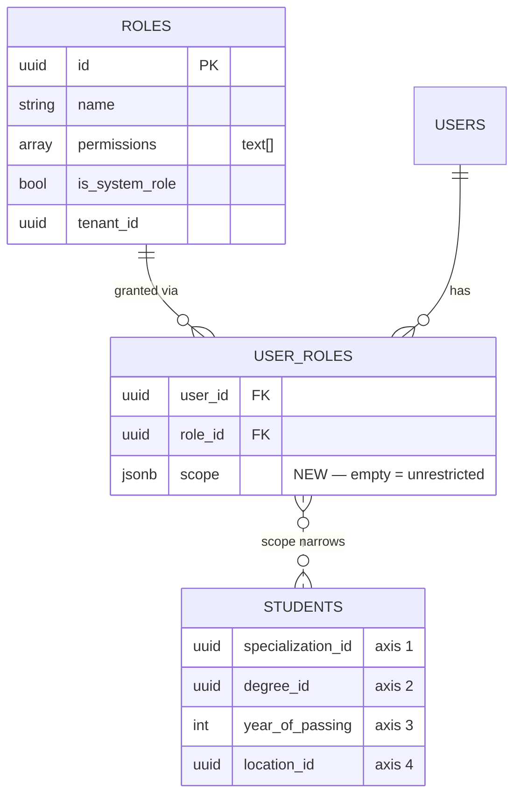

The one schema change — `user_roles.scope` (jsonb):

```elixir
%{
  "specialization_ids" => ["…"],   # absent or empty ⇒ unrestricted on this axis
  "degree_ids"         => ["…"],
  "years_of_passing"   => [2026],
  "location_ids"       => ["…"]
}
```

A user with multiple role assignments gets the **union** (broader wins); any unrestricted
assignment makes them unrestricted.

### 4.1 How a query narrows

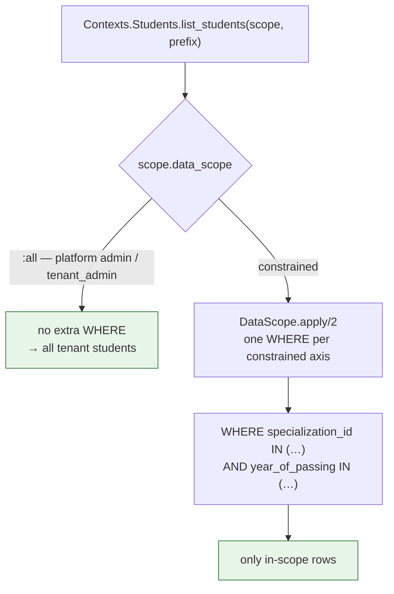

### 4.2 Enforcement points — and one bypass we must close

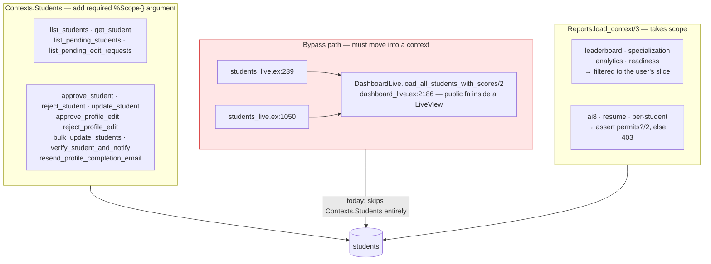

Two design points worth noting:

- **Fail closed by signature.** The `%Scope{}` argument has *no default value*. A call site that
  forgets it fails loudly rather than silently returning every student.
- **Aggregates are filtered too.** Leaderboard, analytics, specialization and readiness reports
  show only the user's slice — a faculty member does not see another department's numbers.

---

## 5. Enforcement mechanics

`live_session`'s `on_mount` is **per-session, not per-route**, so per-route permissions come from
a central policy map rather than dozens of live_sessions:

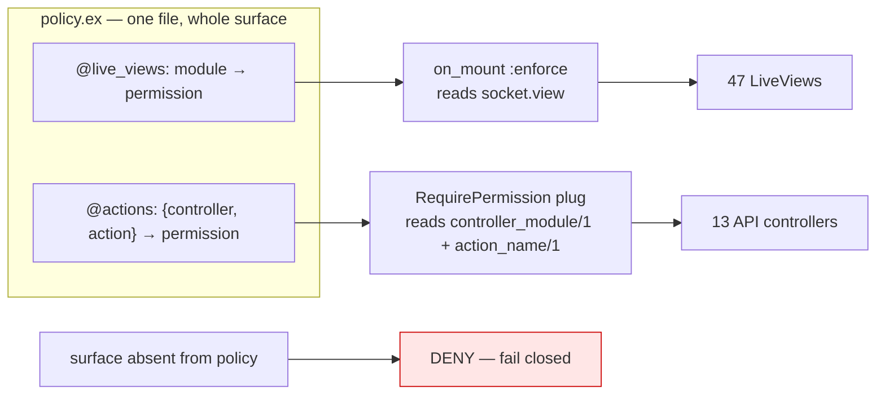

The plug is added **once per authenticated pipeline**, not to 13 controllers individually. The
whole authorization policy is then readable in one file, which is what makes it reviewable.

**Fail-closed is what makes a single cutover safe:** a screen we forget to map breaks loudly in
the coverage test instead of silently staying open.

### 5.1 Deploy safety

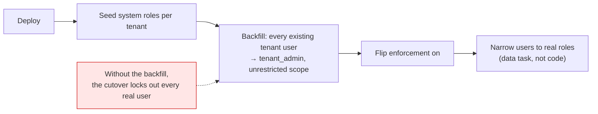

---

## 6. Work breakdown

| File | Change |
|---|---|
| `lib/vyaasa_campus/auth/permissions.ex` | **new** — catalogue, system roles, resolution |
| `lib/vyaasa_campus/auth/data_scope.ex` | **new** — `apply/2`, `permits?/2` |
| `lib/vyaasa_campus_web/authorization/policy.ex` | **new** — route/action → permission |
| `lib/vyaasa_campus_web/authorization/require_permission.ex` | **new** — controller plug |
| `lib/vyaasa_campus/auth/scope.ex` | `can?/2`, MapSet permissions, `data_scope` |
| `lib/vyaasa_campus_web/plugs/scope_plug.ex` | extract scope building for reuse |
| `lib/vyaasa_campus_web/plugs/auth_plug.ex` | on_mount builds Scope; add `:enforce` |
| `lib/vyaasa_campus_web/router.ex` | on_mount + plug; split role/user management scope |
| `lib/vyaasa_campus/contexts/students.ex` | required scope argument on all entry points |
| `lib/vyaasa_campus_web/live/tenant_user/dashboard_live.ex` | move `load_all_students_with_scores` into a context |
| `lib/vyaasa_campus/reports.ex` | scope on `load_context/3`; filter aggregates |
| `lib/vyaasa_campus/contexts/accounts.ex` | validate permissions against catalogue; accept scope |
| `priv/repo/tenant_migrations/*_add_user_role_scope.exs` | `user_roles.scope` jsonb |
| `priv/repo/tenant_migrations/*_seed_system_roles.exs` | seed roles + backfill `tenant_admin` |

Plus a **role-assignment UI** with scope pickers (specialization / degree / year / location;
blank = all).

### 6.1 Sequencing

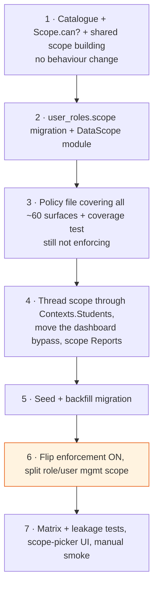

Steps 1–5 are **inert** — nothing is denied until step 6. That reduces a full cutover to a single
reversible switch.

---

## 7. Testing

| # | Test | What it protects |
|---|---|---|
| 1 | **Route coverage** — enumerate `Router.__routes__/0`, assert every authenticated route has a policy entry | Fails if any of ~60 surfaces is unmapped — this is what makes the cutover trustworthy |
| 2 | **Permission matrix** — per system role, allowed → 200, denied → 403/redirect | Makes §3.2 real, not aspirational |
| 3 | **Cross-scope leakage** — a CSE-scoped user cannot list, read-by-id, approve, export or report on an ECE student, and sees only CSE rows in leaderboard/analytics | §4 data scoping, including aggregates |
| 4 | **Direct-id probe** — a foreign student by id returns 403, not a silent empty result | Stops scoping from leaking record existence |
| 5 | **Escalation regression** — non-admin tenant user gets 403 from `POST /api/tenant/roles` | The live defect in §1.1 |
| 6 | **Backfill** — after seeding, an existing tenant user still reaches the dashboard | Nobody is locked out on deploy |
| 7 | **Manual smoke** per persona (tenant admin · faculty · placement officer · student · platform admin) | End-to-end sanity |

Existing scaffolding: `test/support/conn_case.ex`, tenant setup scripts in `test/scripts/`.

---

## 8. Open decisions for the team

| # | Decision | Proposed | Notes |
|---|---|---|---|
| 1 | **The role matrix in §3.2** | As tabled | The main thing to review — are `faculty` and `placement_officer` split correctly for how our colleges actually operate? |
| 2 | **Rollout style** | Big-bang (all surfaces at once) | Agreed. Alternative was surface-by-surface, which leaves gaps open longer |
| 3 | **Aggregate visibility** | Scoped users see only their own slice | Agreed. Alternative: tenant-wide totals with scoped drill-down, if cross-department comparison is a product requirement |
| 4 | **Who gets configurable roles** | Tenant staff only; platform admins and students stay implicit | Avoids a second role store. Revisit if we need e.g. a read-only support engineer role |
| 5 | **Scope axes** | All four configurable (specialization / degree / year / location) | Could be narrowed to specialization only if simpler config is preferred; query cost is the same either way |
| 6 | **Custom roles per tenant** | Allowed, on top of system roles | Schema and API already support it |

## 9. Non-goals

Field-level permissions · role hierarchies and inheritance · audit logging of permission checks ·
scoping of the platform-admin `/admin` area (stays all-powerful) · changes to authentication
itself (Guardian, sessions, tokens are unaffected).
